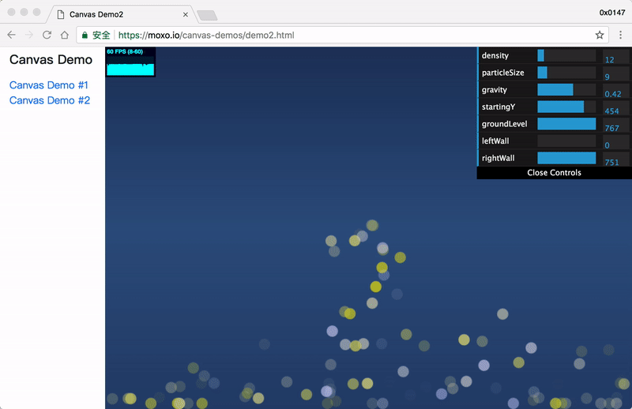

# canvas-demos
Some demos made while learning `<canvas />`. 

FPS Counter used is [stats.js](https://github.com/mrdoob/stats.js), and take advantage of [dat.gui](https://github.com/dataarts/dat.gui) to make things interactive.

___

## Demo #1 
Live: [link](https://moxo.io/canvas-demos/index.html)

___

## Demo #2
Live: [link](https://moxo.io/canvas-demos/demo2.html)

